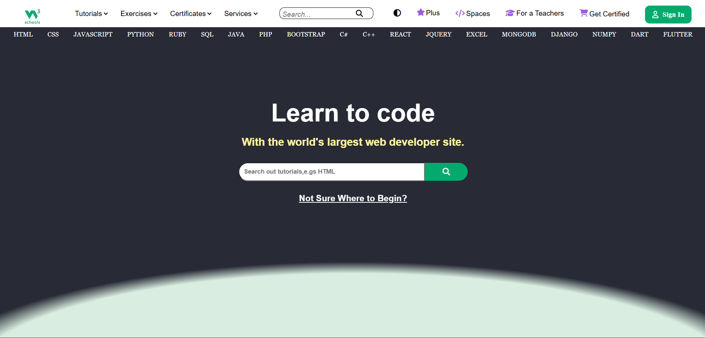

# W3-Clone
> A responsive frontend project inspired by the W3Schools homepage, built using HTML5 and CSS3.

---

##  Project Overview

W3 Clone is a frontend project created to strengthen my HTML and CSS skills by recreating the layout and design of the W3Schools homepage.

The project focuses on building a clean, responsive, and user-friendly interface while practicing modern web development concepts such as semantic HTML, responsive layouts, and CSS styling.

---

## Project Objectives

- Practice semantic HTML5.
- Improve CSS layout and styling techniques.
- Build a responsive webpage.
- Understand real-world webpage structure.
- Enhance frontend development skills through hands-on practice.

---

## Technologies Used

- HTML5
- CSS3

---

##  Features

- Responsive navigation bar
- Hero section
- Course cards
- Responsive layout
- Buttons and call-to-action sections
- Organized content sections
- Footer

---

##  Project Structure

```text
W3-Clone/
│
├── index.html
├── style.css
└── README.md
```

---

## 📸 Project Preview


```markdown

```

---

## 📚 Learning Outcomes

Through this project, I improved my understanding of:

- HTML5 semantic elements
- CSS Flexbox
- Responsive Web Design
- UI Layout Design
- CSS Positioning
- Typography and Spacing

---

## 🚀 Future Improvements

- Add JavaScript for interactive components.
- Improve accessibility.
- Optimize performance.
- Enhance responsiveness for additional screen sizes.
- Implement animations and transitions.

---

## 📜 Disclaimer

This project was created solely for educational and portfolio purposes. It is a frontend recreation inspired by the W3Schools homepage and is not affiliated with, endorsed by, or associated with W3Schools. All trademarks, logos, and brand assets belong to their respective owners.

---

## 👩‍💻 Author

**Manvi**

Computer Science & Engineering Student
